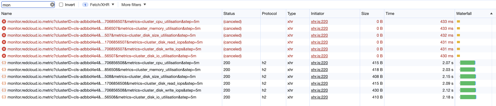

# 自动取消过期的请求

## 使用方式

安装

```shell
npm i --save abort-request
```

## React 使用示例

```tsx
import React, { useState, useEffect, useCallback } from 'react';
import { createAutoAbortExpiredRequest, isAbortError } from 'abort-request';

// 请求方法
const getDataAPI = ({ params }: { params: { id: string } }) => {
    // 发起请求
};

// 在组件外部创建这个请求方法的自动取消版本，确保多次 render 调用是同一个 getDataAPIAutoAbort 方法
const getDataAPIAutoAbort = createAutoAbortExpiredRequest(getDataAPI);

const Demo = () => {
    const [id, setId] = useState();
    const [data, setData] = useState();
    const [loading, setLoading] = useState(false);

    const handleQuery = useCallback(() => {
        setLoading(true);
        // getDataAPIAutoAbort(({ signal }) => [{ params: { id }, signal }]) // 支持传入 signal 来中止请求
        getDataAPIAutoAbort({ params: { id } }) // 简单用法，传参不变，会丢弃请求返回的结果，不会中止请求
            .then((res) => {
                setData(res);
                setLoading(false);
            })
            .catch((err) => {
                // 判断不是取消请求的错误，才可以取消 loading
                if (!isAbortError(err)) {
                    setLoading(false);
                }
            });
    }, [id]);

    useEffect(() => {
        handleQuery();
    }, [handleQuery]);
    return <></>;
};
```

## Vue 使用示例

-   优化前默认版本：

```ts
import { watch, ref, unref } from 'vue';

// 请求方法
const getDataAPI = ({ params }: { params: { id: string } }) => {
    // 发起请求
};

const id = ref();
const detail = ref();

// 调用请求方法，handleQuery 可能多次调用，detail 数据是最新的吗？
const handleQuery = () => {
    getDataAPI({ params: { id: unref(id) } }).then((res) => {
        detail.value = res;
    });
};

watch(id, () => {
    handleQuery();
});
```

### 优化版本 - 避免竞态冲突，detail 总是最新值

```ts
import { createAutoAbortExpiredRequest, isAbortError } from 'abort-request';

// 请求方法
const getDataAPI = ({ params }: { params: { id: string } }) => {
    // 发起请求
};

const id = ref();
const detail = ref();

// 创建这个请求方法的自动取消版本
const getDataAPIAutoAbort = createAutoAbortExpiredRequest(getDataAPI);

const handleQuery = () => {
    // 使用 getDataAPIAutoAbort 替代 getDataAPI 进行调用，传参方式不变
    getDataAPIAutoAbort({ params: { id: unref(id) } }).then((res) => {
        // 当多次调用时，未完成的请求被自动取消，不会进入 then 逻辑
        detail.value = res;
    });
};

watch(id, () => {
    handleQuery();
});
```

### 避免阻塞浏览器 - 如果旧请求还未完成，就取消

XHR 和 Fetch 都支持传入 signal 用于中止请求，可以按照当前项目的封装方式，确定传入 signal 的方法，axios 配置参考：[signal: new AbortController().signal](<https://github.com/axios/axios#:~:text=signal%3A%20new%20AbortController().signal%2C>)

```ts
// 以 logan 为例
const getDataAPI = ({
    params,
    signal,
}: {
    params: { id: string };
    signal?: AbortSignal;
}) => {
    // 发起请求
};

const handleQuery = () => {
    // getDataAPIAutoAbort 可以接受一个函数作为参数，这个函数接受 signal 参数，组装好 signal 后，返回一个数组，用做请求参数
    getDataAPIAutoAbort(({ signal }) => [
        { params: { id: unref(id) }, signal },
    ]).then((res) => {
        // 当多次调用时，未完成的请求被自动取消，不会进入 then 逻辑
        detail.value = res;
    });
};
```

效果如下：

未完成的请求会被取消，新发起的请求会立即开始


### 处理 loading 状态

```ts
const handleQuery = () => {
    loading.value = true;
    getDataAPIAutoAbort(({ signal }) => [{ params: { id: unref(id) }, signal }])
        .then((res) => {
            // 当多次调用时，未完成的请求被自动取消，不会进入 then 逻辑
            detail.value = res;
            loading.value = false;
        })
        .catch((err) => {
            // 判断不是取消请求的错误
            if (!isAbortError(err)) {
                loading.value = false;
            }
        });

    // 不能在 finally 中处理 loading 状态
};
```

### 搭配 axios 全局的异常提示

使用 axios.isCancel 区分被取消的请求

```ts
axios
    .get('/user/12345', {
        cancelToken: source.token,
        signal: controller.signal,
    })
    .catch(function (thrown) {
        if (axios.isCancel(thrown)) {
            console.log('Request canceled', thrown.message);
            // 此时不需要任何提示
        } else {
            // handle error
        }
    });
```
